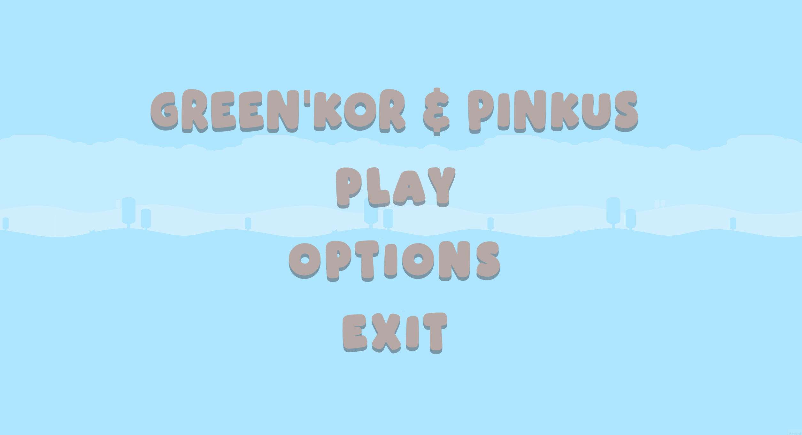
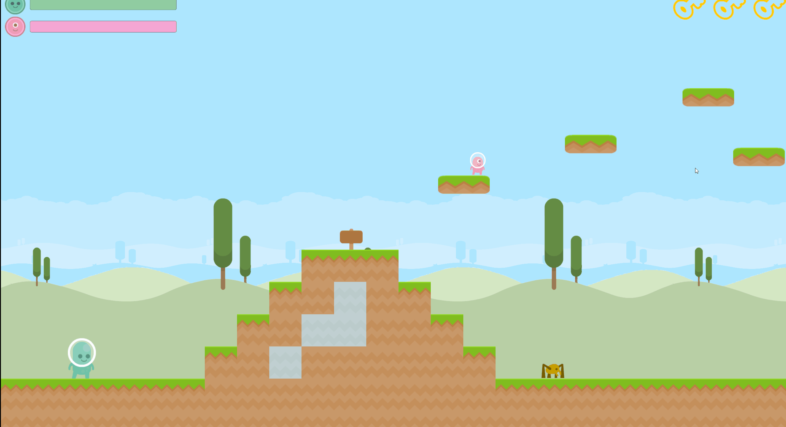
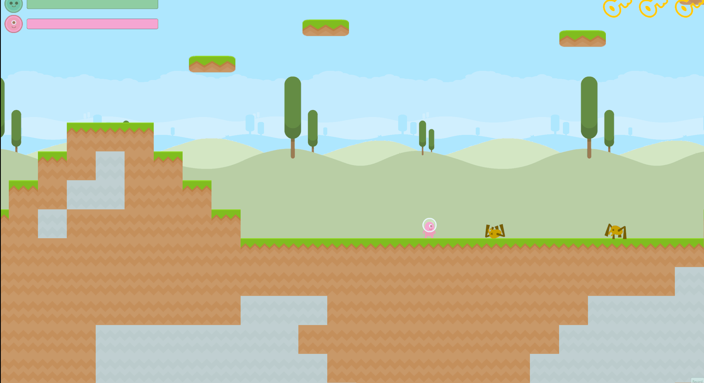
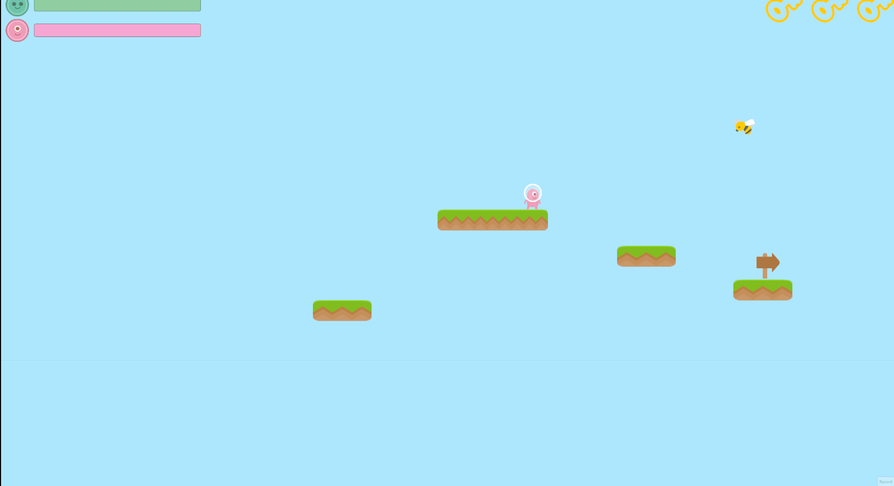
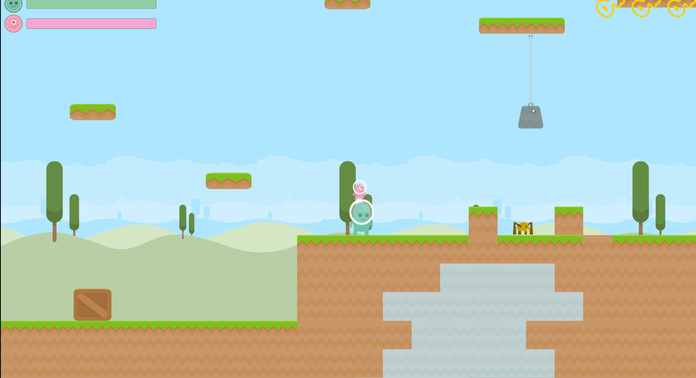

# unity-platformer-demo
A 2D platformer demo built in Unity as a project assignment for the Game Development course at FMI
The game is called "Green'kor and Pinkus" and features two goofy aliens which are the 2 playable characters in the game. 
Each character has his unique stats and mechanics and they have to be played together in cooperation in order to succed.
The game is inspired by the game old Flash game "Fireboy and WaterGirl" which I used to play with my brother when I was a kid.
The game itself is more of a learning experience and is somewhat my first try at making a game.
The code architecture is not perfect but I tried my best to keep it separated properly and not violating SOLID principles

## Gameplay Gifs

### Main Menu

### Movement

### Enemies

### Combat

### Cooperation

### Extra

